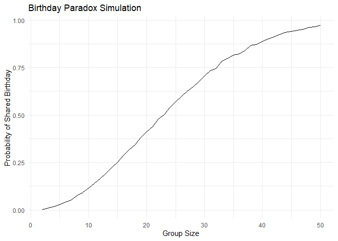
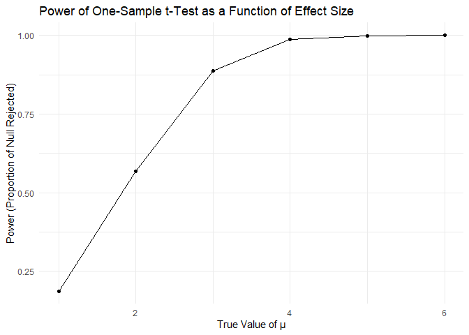
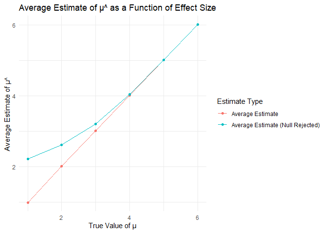
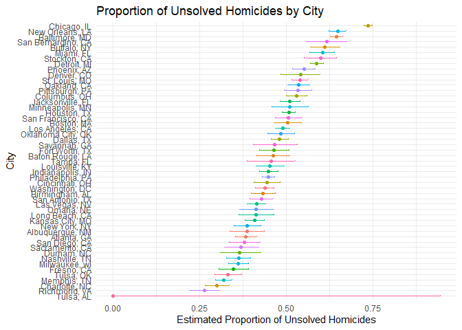

p8105 HW5 jw4693
================
Jianming Wang
2024-11-8

``` r
library(tidyverse)
```

    ## ── Attaching core tidyverse packages ──────────────────────── tidyverse 2.0.0 ──
    ## ✔ dplyr     1.1.4     ✔ readr     2.1.5
    ## ✔ forcats   1.0.0     ✔ stringr   1.5.1
    ## ✔ ggplot2   3.5.1     ✔ tibble    3.2.1
    ## ✔ lubridate 1.9.3     ✔ tidyr     1.3.1
    ## ✔ purrr     1.0.2     
    ## ── Conflicts ────────────────────────────────────────── tidyverse_conflicts() ──
    ## ✖ dplyr::filter() masks stats::filter()
    ## ✖ dplyr::lag()    masks stats::lag()
    ## ℹ Use the conflicted package (<http://conflicted.r-lib.org/>) to force all conflicts to become errors

``` r
library(ggplot2)
set.seed(1)
```

# Problem 1

## birthday function

``` r
bday_sim <- function(n){
bdays = sample(1:365, size = n, replace = T)
duplicate = length(unique(bdays))<n
return(duplicate)
}
```

## iteration for different group size

``` r
sim_res = 
  expand_grid(
    n = 2:50,
    iter = 1:10000
  )|>
  mutate(res = map_lgl(n, bday_sim))|>
  group_by(n)|>
  summarise(prob = mean(res))
```

## plot for probability

``` r
sim_res|>
  ggplot(aes(x = n, y = prob))+
  geom_line()+
  labs(
    x = "Group Size",
    y = "Probability of Shared Birthday",
    title = "Birthday Paradox Simulation"
  ) +
  theme_minimal()
```

<!-- -->

The probability increases sharply as the group size increases. Even with
a small group of around 23 people, the probability of at least two
people sharing a birthday exceeds 50%. With a group size of 50, the
probability is very close to 1 (almost certain).

# Problem 2

## when mu equals 0

``` r
estimates = c()
p_values = c()
for (i in 1:5000) {
    x <- rnorm(30, mean = 0, sd = 5)
    test_result <- t.test(x, mu = 0)|>
      broom::tidy()
    estimates[i] <- test_result$estimate
    p_values[i] <- test_result$p.value
  }
```

## iterations for different mu

``` r
power = c()
avg_estimate = c()
avg_estimate_reject = c()
for (j in 1:6){
  estimates = c()
p_values = c()
for (i in 1:5000) {
    x <- rnorm(30, mean = j, sd = 5)
    test_result <- t.test(x, mu = 0)|>
      broom::tidy()
    estimates[i] <- test_result$estimate
    p_values[i] <- test_result$p.value
}
power[j] <- mean(p_values < 0.05)
  avg_estimate[j] <- mean(estimates)
  avg_estimate_reject[j] <- mean(estimates[p_values < 0.05])
}
```

## plot for power in different effect size

``` r
power = data.frame(
  mu = 1:6,
  power = power
)
```

``` r
ggplot(power, aes(x = mu, y = power)) +
  geom_line() +
  geom_point() +
  labs(
    x = "True Value of μ",
    y = "Power (Proportion of Null Rejected)",
    title = "Power of One-Sample t-Test as a Function of Effect Size"
  ) +
  theme_minimal()
```

<!-- -->

As the true value of μ increases, the power of the test increases. The
power of a one-sample t-test increases with larger effect sizes,
demonstrating that stronger effects are easier to detect.

## plot for average estimates in different mu

``` r
estimate <- data.frame(
  mu = 1:6,
  avg_estimate = avg_estimate,
  avg_estimate_reject = avg_estimate_reject
)
```

``` r
ggplot(estimate, aes(x = mu)) +
  geom_line(aes(y = avg_estimate, color = "Average Estimate")) +
  geom_line(aes(y = avg_estimate_reject, color = "Average Estimate (Null Rejected)")) +
  geom_point(aes(y = avg_estimate, color = "Average Estimate")) +
  geom_point(aes(y = avg_estimate_reject, color = "Average Estimate (Null Rejected)")) +
  labs(
    x = "True Value of μ",
    y = "Average Estimate of μ^",
    title = "Average Estimate of μ^ as a Function of Effect Size",
    color = "Estimate Type"
  ) +
  theme_minimal()
```

<!-- -->

The average estimate of μ^ across all samples is close to the true value
of μ, showing that the estimator is unbiased. However, the average
estimate of μ^ for samples where the null hypothesis is rejected tends
to be higher than the true value of μ, especially when the true effect
size is small. When considering only samples where the null hypothesis
is rejected, the estimates tend to be inflated, especially for small
effect sizes. This inflation arises because only samples with
larger-than-expected estimates will reject the null hypothesis. Thus,
interpreting effect sizes from only significant results can be
misleading, highlighting the importance of considering the full context
of all data in analyses.

# Problem 3

## load and describe the raw data

``` r
homicides <- read_csv("./homicide-data.csv")|>
  janitor::clean_names()
```

    ## Rows: 52179 Columns: 12
    ## ── Column specification ────────────────────────────────────────────────────────
    ## Delimiter: ","
    ## chr (9): uid, victim_last, victim_first, victim_race, victim_age, victim_sex...
    ## dbl (3): reported_date, lat, lon
    ## 
    ## ℹ Use `spec()` to retrieve the full column specification for this data.
    ## ℹ Specify the column types or set `show_col_types = FALSE` to quiet this message.

``` r
summary(homicides)
```

    ##      uid            reported_date       victim_last        victim_first      
    ##  Length:52179       Min.   : 20070101   Length:52179       Length:52179      
    ##  Class :character   1st Qu.: 20100318   Class :character   Class :character  
    ##  Mode  :character   Median : 20121216   Mode  :character   Mode  :character  
    ##                     Mean   : 20130899                                        
    ##                     3rd Qu.: 20150911                                        
    ##                     Max.   :201511105                                        
    ##                                                                              
    ##  victim_race         victim_age         victim_sex            city          
    ##  Length:52179       Length:52179       Length:52179       Length:52179      
    ##  Class :character   Class :character   Class :character   Class :character  
    ##  Mode  :character   Mode  :character   Mode  :character   Mode  :character  
    ##                                                                             
    ##                                                                             
    ##                                                                             
    ##                                                                             
    ##     state                lat             lon          disposition       
    ##  Length:52179       Min.   :25.73   Min.   :-122.51   Length:52179      
    ##  Class :character   1st Qu.:33.77   1st Qu.: -96.00   Class :character  
    ##  Mode  :character   Median :38.52   Median : -87.71   Mode  :character  
    ##                     Mean   :37.03   Mean   : -91.47                     
    ##                     3rd Qu.:40.03   3rd Qu.: -81.76                     
    ##                     Max.   :45.05   Max.   : -71.01                     
    ##                     NA's   :60      NA's   :60

The dataset has 52179 observations and 12 columns. Here’s an outline of
the columns available in the dataset: \* uid: Unique identifier for each
case \* reported_date: Date when the homicide was reported \*
victim_last and victim_first: Last and first names of the victim \*
victim_race: Race of the victim \* victim_age: Age of the victim \*
victim_sex: Sex of the victim \* city and state: Location of the
incident \* lat and lon: Latitude and longitude of the incident \*
disposition: Outcome of the case (e.g., “Closed by arrest,” “Closed
without arrest,” “Open/No arrest”)

## create city_state variable and summarise

``` r
homicides = homicides|>
  mutate(city_state = paste(city, state, sep = ", "))
summ_homicides <- homicides|>
  group_by(city_state) |>
  summarize(
    total_homicides = n(),
    unsolved_homicides = sum(disposition %in% c("Closed without arrest", "Open/No arrest"))
  )
summ_homicides|>knitr::kable()
```

| city_state         | total_homicides | unsolved_homicides |
|:-------------------|----------------:|-------------------:|
| Albuquerque, NM    |             378 |                146 |
| Atlanta, GA        |             973 |                373 |
| Baltimore, MD      |            2827 |               1825 |
| Baton Rouge, LA    |             424 |                196 |
| Birmingham, AL     |             800 |                347 |
| Boston, MA         |             614 |                310 |
| Buffalo, NY        |             521 |                319 |
| Charlotte, NC      |             687 |                206 |
| Chicago, IL        |            5535 |               4073 |
| Cincinnati, OH     |             694 |                309 |
| Columbus, OH       |            1084 |                575 |
| Dallas, TX         |            1567 |                754 |
| Denver, CO         |             312 |                169 |
| Detroit, MI        |            2519 |               1482 |
| Durham, NC         |             276 |                101 |
| Fort Worth, TX     |             549 |                255 |
| Fresno, CA         |             487 |                169 |
| Houston, TX        |            2942 |               1493 |
| Indianapolis, IN   |            1322 |                594 |
| Jacksonville, FL   |            1168 |                597 |
| Kansas City, MO    |            1190 |                486 |
| Las Vegas, NV      |            1381 |                572 |
| Long Beach, CA     |             378 |                156 |
| Los Angeles, CA    |            2257 |               1106 |
| Louisville, KY     |             576 |                261 |
| Memphis, TN        |            1514 |                483 |
| Miami, FL          |             744 |                450 |
| Milwaukee, wI      |            1115 |                403 |
| Minneapolis, MN    |             366 |                187 |
| Nashville, TN      |             767 |                278 |
| New Orleans, LA    |            1434 |                930 |
| New York, NY       |             627 |                243 |
| Oakland, CA        |             947 |                508 |
| Oklahoma City, OK  |             672 |                326 |
| Omaha, NE          |             409 |                169 |
| Philadelphia, PA   |            3037 |               1360 |
| Phoenix, AZ        |             914 |                504 |
| Pittsburgh, PA     |             631 |                337 |
| Richmond, VA       |             429 |                113 |
| Sacramento, CA     |             376 |                139 |
| San Antonio, TX    |             833 |                357 |
| San Bernardino, CA |             275 |                170 |
| San Diego, CA      |             461 |                175 |
| San Francisco, CA  |             663 |                336 |
| Savannah, GA       |             246 |                115 |
| St. Louis, MO      |            1677 |                905 |
| Stockton, CA       |             444 |                266 |
| Tampa, FL          |             208 |                 95 |
| Tulsa, AL          |               1 |                  0 |
| Tulsa, OK          |             583 |                193 |
| Washington, DC     |            1345 |                589 |

## perform prop.test

``` r
Baltimore_test = prop.test(summ_homicides[which(summ_homicides$city_state == 'Baltimore, MD'),]$unsolved_homicides, summ_homicides[which(summ_homicides$city_state == 'Baltimore, MD'),]$total_homicides)
Baltimore_test|>
  broom::tidy()|>
  select(estimate, conf.low, conf.high)
```

    ## # A tibble: 1 × 3
    ##   estimate conf.low conf.high
    ##      <dbl>    <dbl>     <dbl>
    ## 1    0.646    0.628     0.663

``` r
prop_test_results <- summ_homicides %>%
  mutate(
    prop_test = purrr::map2(unsolved_homicides, total_homicides, 
                     ~broom::tidy(prop.test(.x, .y))))|>
  unnest(prop_test)|>
  select(-statistic, -parameter, -method, -alternative)|>
  janitor::clean_names()
```

    ## Warning: There was 1 warning in `mutate()`.
    ## ℹ In argument: `prop_test = purrr::map2(...)`.
    ## Caused by warning in `prop.test()`:
    ## ! Chi-squared近似算法有可能不准

``` r
prop_test_results|>
  knitr::kable(digits = 3)
```

| city_state | total_homicides | unsolved_homicides | estimate | p_value | conf_low | conf_high |
|:---|---:|---:|---:|---:|---:|---:|
| Albuquerque, NM | 378 | 146 | 0.386 | 0.000 | 0.337 | 0.438 |
| Atlanta, GA | 973 | 373 | 0.383 | 0.000 | 0.353 | 0.415 |
| Baltimore, MD | 2827 | 1825 | 0.646 | 0.000 | 0.628 | 0.663 |
| Baton Rouge, LA | 424 | 196 | 0.462 | 0.132 | 0.414 | 0.511 |
| Birmingham, AL | 800 | 347 | 0.434 | 0.000 | 0.399 | 0.469 |
| Boston, MA | 614 | 310 | 0.505 | 0.840 | 0.465 | 0.545 |
| Buffalo, NY | 521 | 319 | 0.612 | 0.000 | 0.569 | 0.654 |
| Charlotte, NC | 687 | 206 | 0.300 | 0.000 | 0.266 | 0.336 |
| Chicago, IL | 5535 | 4073 | 0.736 | 0.000 | 0.724 | 0.747 |
| Cincinnati, OH | 694 | 309 | 0.445 | 0.004 | 0.408 | 0.483 |
| Columbus, OH | 1084 | 575 | 0.530 | 0.048 | 0.500 | 0.560 |
| Dallas, TX | 1567 | 754 | 0.481 | 0.143 | 0.456 | 0.506 |
| Denver, CO | 312 | 169 | 0.542 | 0.157 | 0.485 | 0.598 |
| Detroit, MI | 2519 | 1482 | 0.588 | 0.000 | 0.569 | 0.608 |
| Durham, NC | 276 | 101 | 0.366 | 0.000 | 0.310 | 0.426 |
| Fort Worth, TX | 549 | 255 | 0.464 | 0.105 | 0.422 | 0.507 |
| Fresno, CA | 487 | 169 | 0.347 | 0.000 | 0.305 | 0.391 |
| Houston, TX | 2942 | 1493 | 0.507 | 0.428 | 0.489 | 0.526 |
| Indianapolis, IN | 1322 | 594 | 0.449 | 0.000 | 0.422 | 0.477 |
| Jacksonville, FL | 1168 | 597 | 0.511 | 0.464 | 0.482 | 0.540 |
| Kansas City, MO | 1190 | 486 | 0.408 | 0.000 | 0.380 | 0.437 |
| Las Vegas, NV | 1381 | 572 | 0.414 | 0.000 | 0.388 | 0.441 |
| Long Beach, CA | 378 | 156 | 0.413 | 0.001 | 0.363 | 0.464 |
| Los Angeles, CA | 2257 | 1106 | 0.490 | 0.354 | 0.469 | 0.511 |
| Louisville, KY | 576 | 261 | 0.453 | 0.027 | 0.412 | 0.495 |
| Memphis, TN | 1514 | 483 | 0.319 | 0.000 | 0.296 | 0.343 |
| Miami, FL | 744 | 450 | 0.605 | 0.000 | 0.569 | 0.640 |
| Milwaukee, wI | 1115 | 403 | 0.361 | 0.000 | 0.333 | 0.391 |
| Minneapolis, MN | 366 | 187 | 0.511 | 0.714 | 0.459 | 0.563 |
| Nashville, TN | 767 | 278 | 0.362 | 0.000 | 0.329 | 0.398 |
| New Orleans, LA | 1434 | 930 | 0.649 | 0.000 | 0.623 | 0.673 |
| New York, NY | 627 | 243 | 0.388 | 0.000 | 0.349 | 0.427 |
| Oakland, CA | 947 | 508 | 0.536 | 0.027 | 0.504 | 0.569 |
| Oklahoma City, OK | 672 | 326 | 0.485 | 0.464 | 0.447 | 0.524 |
| Omaha, NE | 409 | 169 | 0.413 | 0.001 | 0.365 | 0.463 |
| Philadelphia, PA | 3037 | 1360 | 0.448 | 0.000 | 0.430 | 0.466 |
| Phoenix, AZ | 914 | 504 | 0.551 | 0.002 | 0.518 | 0.584 |
| Pittsburgh, PA | 631 | 337 | 0.534 | 0.095 | 0.494 | 0.573 |
| Richmond, VA | 429 | 113 | 0.263 | 0.000 | 0.223 | 0.308 |
| Sacramento, CA | 376 | 139 | 0.370 | 0.000 | 0.321 | 0.421 |
| San Antonio, TX | 833 | 357 | 0.429 | 0.000 | 0.395 | 0.463 |
| San Bernardino, CA | 275 | 170 | 0.618 | 0.000 | 0.558 | 0.675 |
| San Diego, CA | 461 | 175 | 0.380 | 0.000 | 0.335 | 0.426 |
| San Francisco, CA | 663 | 336 | 0.507 | 0.756 | 0.468 | 0.545 |
| Savannah, GA | 246 | 115 | 0.467 | 0.339 | 0.404 | 0.532 |
| St. Louis, MO | 1677 | 905 | 0.540 | 0.001 | 0.515 | 0.564 |
| Stockton, CA | 444 | 266 | 0.599 | 0.000 | 0.552 | 0.645 |
| Tampa, FL | 208 | 95 | 0.457 | 0.239 | 0.388 | 0.527 |
| Tulsa, AL | 1 | 0 | 0.000 | 1.000 | 0.000 | 0.945 |
| Tulsa, OK | 583 | 193 | 0.331 | 0.000 | 0.293 | 0.371 |
| Washington, DC | 1345 | 589 | 0.438 | 0.000 | 0.411 | 0.465 |

## plot for estimates and CIs

``` r
ggplot(prop_test_results, aes(x = reorder(city_state, estimate), y = estimate, color = city_state)) +
  geom_point() +
  geom_errorbar(aes(ymin = conf_low, ymax = conf_high), width = 0.2) +
  coord_flip() +
  labs(
    title = "Proportion of Unsolved Homicides by City",
    x = "City",
    y = "Estimated Proportion of Unsolved Homicides"
  ) +
  theme_minimal()+
  theme(legend.position = 'none')
```

<!-- -->

The plot shows the estimated proportion of unsolved homicides for each
city, along with 95% confidence intervals. Cities are sorted in
decreasing order by the proportion of unsolved cases.
